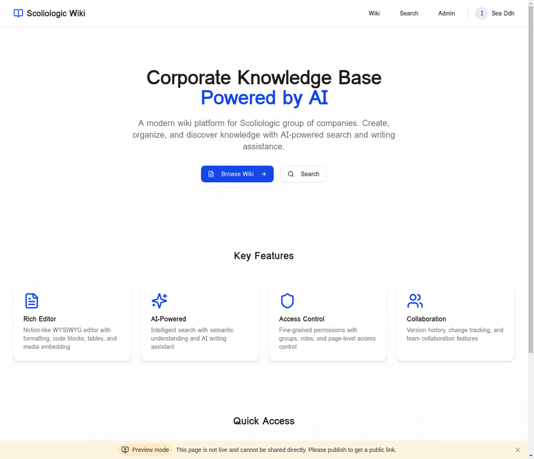
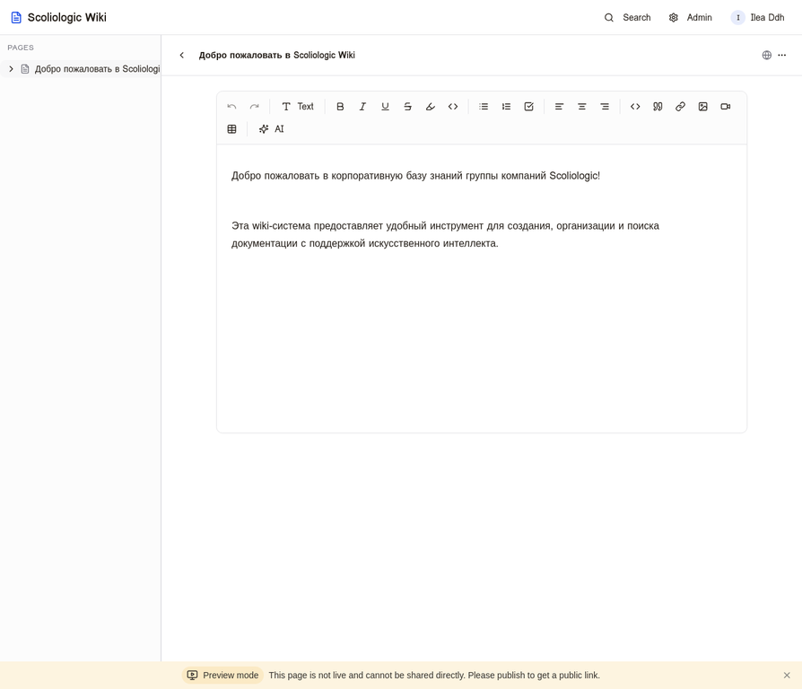
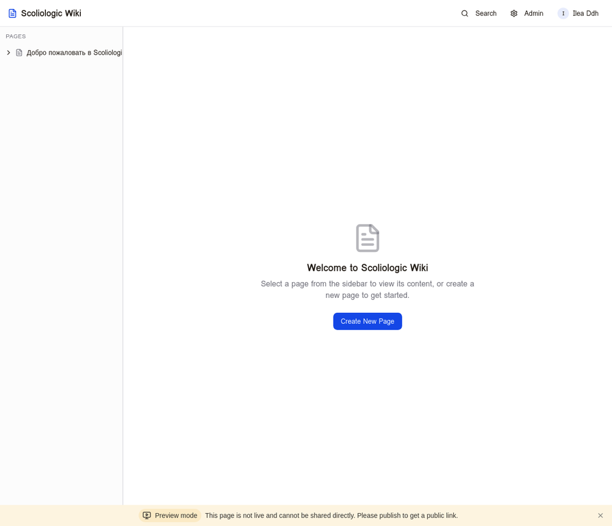
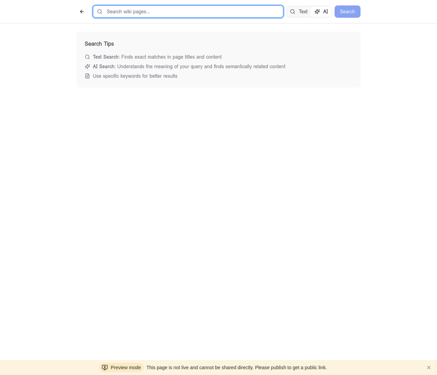
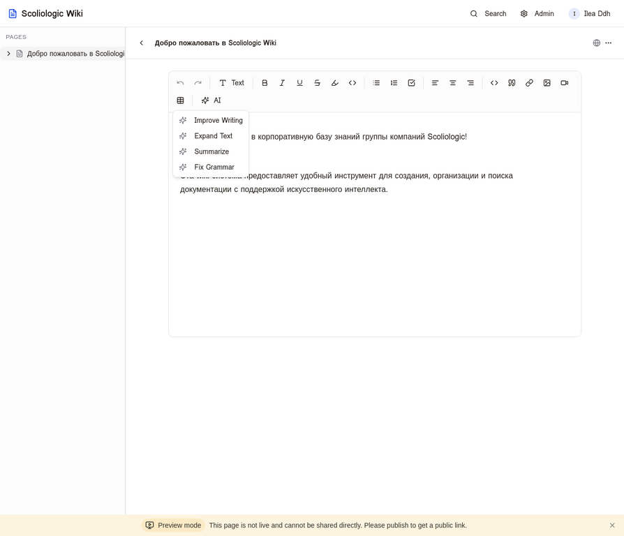
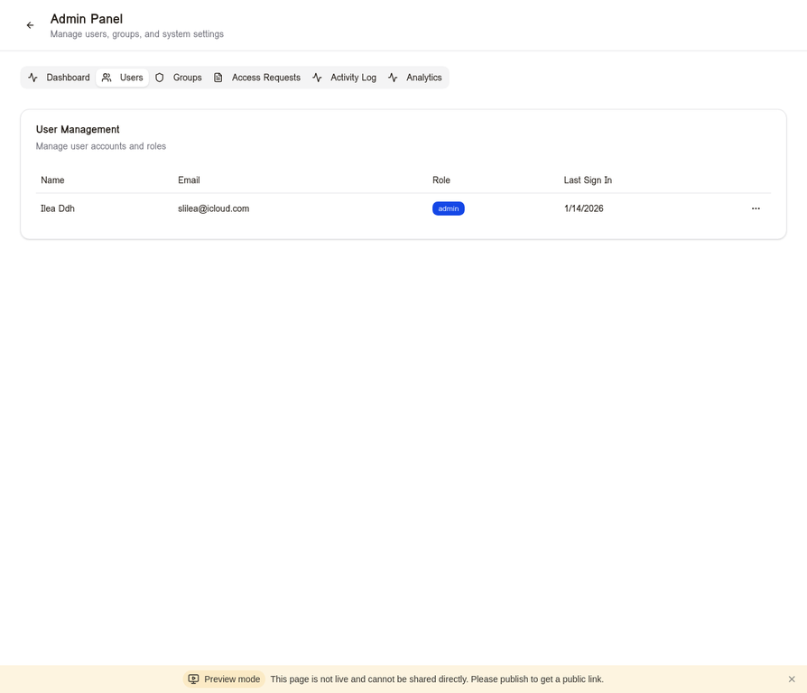
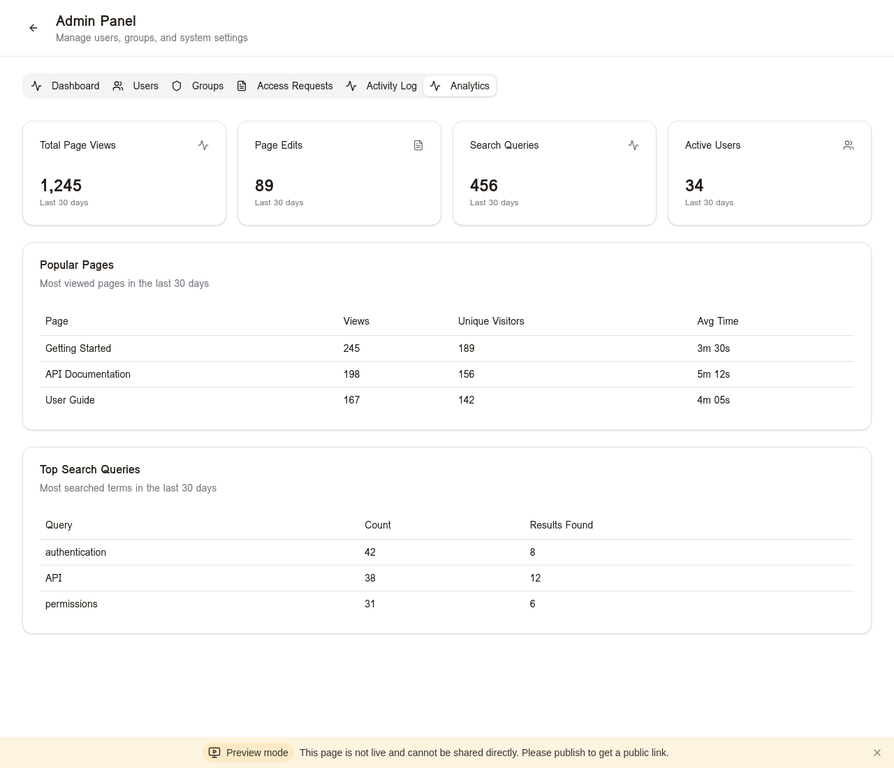
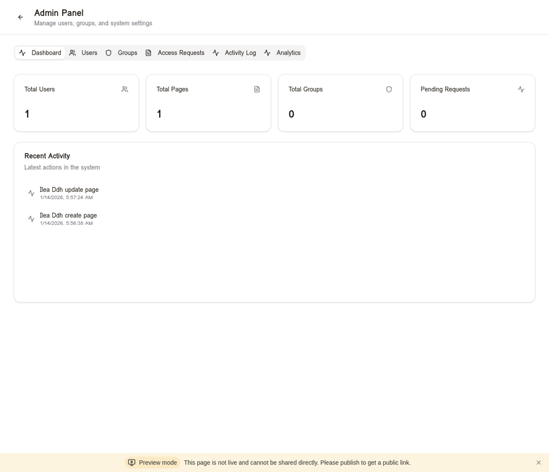

# Scoliologic Wiki

<div align="center">



**Корпоративная база знаний с искусственным интеллектом**

[](LICENSE)
[](docker-compose.yml)
[](https://www.typescriptlang.org/)
[](https://reactjs.org/)

</div>

---

## Обзор

Scoliologic Wiki — это современная корпоративная wiki-платформа, разработанная для группы компаний Scoliologic. Система объединяет удобный Notion-подобный редактор с мощными AI-возможностями для поиска и создания контента. Все AI-функции работают локально через Ollama, что гарантирует полную конфиденциальность данных.

### Ключевые преимущества

| Преимущество | Описание |
|-------------|----------|
| **Notion-подобный редактор** | WYSIWYG редактор с автоформатированием, поддержкой таблиц, кода и медиа |
| **Локальный AI** | Семантический поиск и 9 инструментов для написания через Ollama |
| **Полный контроль доступа** | Роли, группы, уровни доступа к страницам |
| **Self-hosted** | Docker Compose развёртывание за 5 минут |
| **Интеграция Authentik** | OAuth2 авторизация и синхронизация групп |

---

## Функциональность

### Редактор контента



Полнофункциональный WYSIWYG редактор на базе TipTap предоставляет все необходимые инструменты для создания документации:

- **Форматирование текста**: жирный, курсив, подчёркивание, зачёркивание
- **Структура**: заголовки H1-H6, маркированные и нумерованные списки, чек-листы
- **Код**: блоки кода с подсветкой синтаксиса, inline-код
- **Медиа**: изображения через S3, видео (YouTube, RuTube, VK Video)
- **Таблицы**: создание и редактирование таблиц с управлением ячейками
- **Цитаты и ссылки**: блоки цитат, внешние и внутренние ссылки

Редактор поддерживает автоформатирование при вводе — Markdown-синтаксис автоматически преобразуется в соответствующие элементы:

| Ввод | Результат |
|------|-----------|
| `# ` | Заголовок H1 |
| `## ` | Заголовок H2 |
| `- ` или `* ` | Маркированный список |
| `1. ` | Нумерованный список |
| `[] ` | Чек-лист |
| ` ``` ` | Блок кода |
| `> ` | Цитата |

---

### Иерархическая структура страниц



Система организации контента позволяет создавать логичную древовидную структуру документации:

- **Неограниченная вложенность** — страницы могут содержать подстраницы любой глубины
- **Древовидная навигация** — боковая панель с раскрывающимися разделами
- **Drag-and-drop** — перетаскивание страниц для реорганизации структуры
- **Быстрый поиск** — мгновенный поиск по дереву страниц
- **Иконки** — эмодзи и иконки для визуального различения страниц

---

### Интеллектуальный поиск



Система предоставляет два режима поиска для максимальной эффективности:

**Текстовый поиск с Fuzzy Matching** обеспечивает поиск по частичным совпадениям с интеллектуальным ранжированием результатов:
- Точные совпадения получают высший приоритет
- Совпадения в начале слова имеют средний приоритет
- Частичные совпадения внутри слов также находятся
- Например, запрос «лечен» найдёт статьи о «лечении», «методах лечения» и т.д.

**AI-поиск (семантический)** использует векторные embeddings через локальный Ollama для понимания смысла запроса. Система находит релевантный контент даже без точных совпадений слов. Например, запрос «как настроить доступ» найдёт статьи о правах пользователей, управлении группами и ролях.

**Гибридный режим**: AI-поиск автоматически переключается на текстовый поиск, если Ollama недоступен, обеспечивая бесперебойную работу.

---

### AI-помощник для написания



Встроенный AI-помощник предоставляет 9 инструментов для создания и улучшения контента:

| Инструмент | Описание |
|-----------|----------|
| **Improve Writing** | Улучшение стиля и читаемости текста |
| **Expand Text** | Расширение кратких заметок в полные статьи |
| **Summarize** | Создание кратких резюме из длинных текстов |
| **Fix Grammar** | Исправление грамматики и орфографии |
| **Change Tone** | Изменение тона (формальный, неформальный, технический) |
| **Extract Keywords** | Извлечение ключевых слов для тегов |
| **SEO Optimize** | Оптимизация контента для поиска |
| **Create Outline** | Генерация структуры статьи из темы |
| **Generate Content** | Создание полного контента из плана |

> **Важно**: Все AI-функции работают локально через Ollama — данные не покидают ваш сервер!

---

### Управление доступом



Гибкая система прав и ролей обеспечивает безопасность корпоративных данных:

**Роли пользователей:**
- **Admin** — полный доступ к системе и настройкам
- **Editor** — создание и редактирование страниц
- **Reader** — только чтение страниц
- **Guest** — доступ к публичным страницам без авторизации

**Уровни доступа к страницам:**
- **Public** — видна всем, включая гостей
- **Group** — видна только членам указанной группы
- **Private** — видна только владельцу страницы

---

### Управление группами


Система групп позволяет организовать пользователей по командам и отделам:

- Создание групп для отделов и команд
- Добавление пользователей в группы
- Назначение прав доступа на уровне группы
- Синхронизация с Authentik

**Примеры использования:**
- Группа «Разработка» — доступ к техническим документам
- Группа «HR» — доступ к кадровым документам
- Группа «Руководство» — доступ ко всем материалам

---

### Аналитика и метрики



Дашборд аналитики предоставляет полную картину использования wiki:

- **Метрики дашборда**: просмотры страниц, редактирования, поисковые запросы, активные пользователи
- **Популярные страницы**: рейтинг по просмотрам, уникальные посетители, время на странице
- **Аналитика поиска**: топ запросов, количество результатов, выявление пробелов в контенте

---

### Админ-панель



Централизованная панель управления для администраторов системы:

- Управление пользователями и их ролями
- Управление группами и членством
- Мониторинг системы и активности
- Настройки интеграций (Authentik, Ollama)
- Журнал аудита действий

---

### Дополнительные возможности

**Версионирование** — полная история изменений каждой страницы с возможностью просмотра любой версии, отката и сравнения версий.

**Шаблоны страниц** — готовые шаблоны для типовых документов, создание собственных шаблонов, быстрое создание страниц из шаблона.

**Экспорт** — выгрузка страниц в PDF для печати и архивации, Markdown для миграции.

**Тёмная тема** — автоопределение по системным настройкам, ручное переключение, комфортная работа в любое время.


**Многоязычность (i18n)** — полная поддержка русского и английского языков интерфейса. Система автоматически определяет язык браузера при первом посещении и сохраняет выбор пользователя. Локализованы все элементы интерфейса, включая редактор, уведомления и админ-панель.

| Функция | Описание |
|---------|----------|
| Автоопределение языка | Использует navigator.language для выбора языка при первом визите |
| Сохранение выбора | Выбранный язык сохраняется в localStorage |
| Переключатель языка | Иконка в навигации для быстрого переключения |
| Локализация редактора | Все тултипы и меню редактора переведены |

---

## Технологический стек

| Компонент | Технология |
|-----------|-----------|
| **Frontend** | React 19, TypeScript, TailwindCSS, TipTap |
| **Backend** | Node.js, Express, tRPC |
| **База данных** | PostgreSQL |
| **Хранилище** | MinIO (S3-совместимое) |
| **AI** | Ollama (локальные модели) |
| **Авторизация** | Authentik OAuth2 |
| **Reverse Proxy** | Traefik с автоматическим SSL |

---

## Быстрый старт

### Требования

- Docker и Docker Compose
- 8GB+ RAM (16GB+ рекомендуется для AI)
- 20GB+ дискового пространства
- Authentik сервер для OAuth (опционально)

### Автоматическая установка (Debian/Ubuntu)

```bash
curl -fsSL https://raw.githubusercontent.com/sileade/scoliologic-wiki/main/deploy/install.sh | sudo bash
```

Скрипт предложит выбор:
1. **Full Stack** — новый Traefik + Wiki + Ollama
2. **Wiki Only** — использовать существующий Traefik
3. **Wiki + Ollama** — использовать существующий Traefik с AI

### Ручная установка

1. **Клонируйте репозиторий:**
```bash
git clone https://github.com/sileade/scoliologic-wiki.git
cd scoliologic-wiki
```

2. **Настройте переменные окружения:**
```bash
cp config.env.example config.env
# Отредактируйте config.env с вашими настройками
```

3. **Запустите сервисы:**
```bash
docker-compose up -d
```

4. **Загрузите AI модели:**
```bash
docker exec -it ollama ollama pull nomic-embed-text
docker exec -it ollama ollama pull llama3.2
```

5. **Откройте в браузере:**
```
https://wiki.yourdomain.com
```

---

## Конфигурация

### Переменные окружения

| Переменная | Описание | Пример |
|-----------|----------|--------|
| `WIKI_DOMAIN` | Домен для wiki | `wiki.example.com` |
| `DATABASE_URL` | Строка подключения к PostgreSQL | `postgresql://user:pass@db:5432/wiki` |
| `S3_ENDPOINT` | Endpoint MinIO/S3 | `http://minio:9000` |
| `S3_ACCESS_KEY` | Ключ доступа S3 | `minioadmin` |
| `S3_SECRET_KEY` | Секретный ключ S3 | `minioadmin` |
| `OLLAMA_URL` | URL Ollama сервера | `http://ollama:11434` |
| `AUTHENTIK_URL` | URL Authentik сервера | `https://auth.example.com` |
| `AUTHENTIK_CLIENT_ID` | Client ID OAuth | `wiki-client` |
| `AUTHENTIK_CLIENT_SECRET` | Client Secret OAuth | `secret` |

### Интеграция с Authentik

Для настройки OAuth2 авторизации через Authentik:

1. **Создайте OAuth2/OpenID Provider в Authentik:**
   - Тип: OAuth2/OpenID Provider
   - Client Type: Confidential
   - Redirect URIs: `https://wiki.yourdomain.com/api/authentik/callback`
   - Scopes: `openid profile email groups`

2. **Настройте переменные окружения:**
   ```env
   AUTHENTIK_ENABLED=true
   AUTHENTIK_URL=https://auth.example.com
   AUTHENTIK_CLIENT_ID=wiki-client
   AUTHENTIK_CLIENT_SECRET=your-secret
   AUTHENTIK_API_TOKEN=your-api-token
   ```

3. **API Token для синхронизации:**
   - В Authentik создайте API Token с правами на чтение пользователей и групп
   - Добавьте токен в `AUTHENTIK_API_TOKEN`

4. **Синхронизация пользователей и групп:**
   - В админ-панели Wiki перейдите в раздел "Authentik"
   - Нажмите "Полная синхронизация" для импорта пользователей и групп
   - Синхронизация также выполняется автоматически каждый час

5. **Права доступа:**
   - Группы из Authentik автоматически создаются в Wiki
   - Членство в группах синхронизируется при входе пользователя
   - Суперпользователи Authentik получают роль admin в Wiki

### AI-модели (Ollama)

После запуска загрузите необходимые модели:

```bash
# Модель для эмбеддингов (семантический поиск)
docker exec wiki-ollama ollama pull nomic-embed-text

# Модель для генерации текста (AI-помощник)
docker exec wiki-ollama ollama pull llama3.2
```

### Удалённая Ollama в локальной сети

Если Ollama установлена на другой машине в локальной сети, настройте подключение:

```env
# В config.env укажите IP или hostname сервера с Ollama
OLLAMA_URL=http://192.168.1.100:11434
```

На сервере с Ollama убедитесь, что сервис доступен из сети:

```bash
# Редактируйте /etc/systemd/system/ollama.service
# Добавьте в [Service]:
Environment="OLLAMA_HOST=0.0.0.0"

# Перезапустите сервис
sudo systemctl daemon-reload
sudo systemctl restart ollama
```

### Настройка Ollama через админ-панель

В админ-панели перейдите в раздел "Ollama AI" для настройки:

| Параметр | Описание |
|----------|----------|
| **URL сервера** | Адрес Ollama (http://localhost:11434 или IP удалённого сервера) |
| **Модель эмбеддингов** | Модель для семантического поиска (nomic-embed-text) |
| **Модель генерации** | Модель для AI-помощника (llama3.2) |
| **Интервал проверки** | Как часто проверять доступность (10-3600 сек) |
| **Уведомления** | Отправлять уведомления при сбоях |

---

### Система мониторинга и автоисправления

Wiki включает встроенную систему мониторинга, которая автоматически:

- **Проверяет доступность Ollama** с настраиваемым интервалом
- **Отслеживает ошибки** и ведёт журнал с таймстампами
- **Автоматически исправляет** известные проблемы (fallback на текстовый поиск при недоступности AI)
- **Отправляет уведомления** администратору при сбоях
- **Собирает метрики** производительности (время отклика, количество запросов)

Панель мониторинга доступна в админ-панели в разделе "Ollama AI" и показывает:

| Метрика | Описание |
|---------|----------|
| **Статус Ollama** | Здоров/Недоступен с индикатором |
| **Запросы** | Общее количество запросов |
| **Средний отклик** | Время ответа в миллисекундах |
| **Ошибки/час** | Количество ошибок за последний час |
| **Статистика ошибок** | Всего/Исправлено/Авто-исправлено |
| **Последние ошибки** | Журнал с временем и статусом |

### AI-агент непрерывного мониторинга

В админ-панели доступна настройка самообучающегося AI-агента:

| Параметр | Описание |
|----------|----------|
| **Модель для анализа** | LLM модель для анализа ошибок и принятия решений |
| **Интервал мониторинга** | Как часто агент анализирует логи (60-3600 сек) |
| **Автоисправление** | Агент пытается исправить ошибки самостоятельно |
| **Макс. попыток** | Количество попыток исправления до эскалации |
| **Порог эскалации** | После N неудач — уведомление администратору |
| **Балансировщик** | Интеграция с Traefik/Nginx для управления нагрузкой |
| **Самообучение** | Агент учится на успешных исправлениях |
| **Хранение логов** | Срок хранения логов для анализа (7-365 дней) |

---

### Интеграция с Traefik

В админ-панели доступна полная интеграция с Traefik для управления балансировкой нагрузки:

| Параметр | Описание |
|----------|----------|
| **URL API** | Адрес Traefik API (http://traefik:8080) |
| **Пользователь API** | Имя пользователя для Basic Auth |
| **Пароль API** | Пароль для Basic Auth |
| **Entry Point** | Точка входа (websecure) |
| **URL дашборда** | Ссылка на Traefik Dashboard |
| **Prometheus URL** | URL для сбора метрик |
| **Docker Socket** | Путь к Docker socket для управления контейнерами |

#### Функции интеграции

**Роутеры и сервисы:**
- Просмотр всех HTTP/TCP роутеров и сервисов
- Фильтрация по статусу (enabled/disabled)
- Отображение правил маршрутизации и сервисов

**Генерация конфигураций:**
- Автоматическая генерация YAML/TOML для wiki-страниц
- Поддержка Traefik file provider
- Экспорт конфигураций в файл

**Prometheus метрики:**
- Графики запросов по сервисам
- Графики латентности (p50, p90, p99)
- Графики ошибок 4xx/5xx
- Исторические тренды за час/день/неделю

**Алерты:**
- Настройка порогов ошибок и латентности
- Уведомления через Telegram, Slack, Email, Webhook
- Журнал срабатываний алертов

**Docker интеграция:**
- Перезагрузка Traefik контейнера
- Применение конфигураций через Docker API

### Уведомления Telegram/Slack

Система поддерживает отправку уведомлений об алертах в мессенджеры:

| Канал | Настройка |
|-------|----------|
| **Telegram** | Bot Token + Chat ID |
| **Slack** | Webhook URL |
| **Email** | SMTP настройки |
| **Webhook** | Custom URL для интеграций |

Функции:
- Тестовая отправка уведомлений
- Валидация токенов и webhook
- Журнал отправленных уведомлений
- Автоматическая отправка при срабатывании алертов

### Интеграция с MinIO S3

Для хранения файлов и медиа используется S3-совместимое хранилище MinIO:

| Параметр | Описание |
|----------|----------|
| **Endpoint** | Адрес MinIO сервера (minio.local) |
| **Порт** | Порт API (9000) |
| **SSL** | Использовать HTTPS |
| **Access Key** | Ключ доступа |
| **Secret Key** | Секретный ключ |
| **Bucket** | Имя бакета (wiki-files) |
| **Region** | Регион (us-east-1) |
| **Public URL** | Публичный URL для доступа к файлам |

### Дашборд метрик

В админ-панели доступен дашборд с графиками метрик производительности:

| Метрика | Описание |
|---------|----------|
| **Время отклика** | График времени ответа сервера |
| **Количество ошибок** | График ошибок за период |
| **Количество запросов** | График запросов к API |
| **Использование памяти** | График RAM |
| **Загрузка CPU** | График процессора |

Графики построены на Chart.js с выбором периода (1-168 часов).

---

## AI-архитектура

### Необходимые AI-компоненты

Для полноценной работы всех AI-функций требуются следующие модели:

| Модель | Назначение | Размер | Требования |
|--------|------------|--------|------------|
| `nomic-embed-text` | Векторные эмбеддинги для семантического поиска | ~275MB | 2GB RAM |
| `llama3.2` | Генерация текста, AI-помощник | ~2GB | 8GB RAM |
| `llama3.2:1b` | Лёгкая версия для слабых серверов | ~1GB | 4GB RAM |

### Функции AI

| Функция | Модель | Описание |
|---------|--------|----------|
| **Семантический поиск** | nomic-embed-text | Поиск по смыслу, а не по ключевым словам |
| **AI-помощник** | llama3.2 | 9 инструментов для работы с текстом |
| **Автоиндексация** | nomic-embed-text | Автоматическое создание эмбеддингов при сохранении |

### Режимы работы

**Полный режим** (с Ollama):
- Семантический поиск по всей базе знаний
- AI-помощник для написания и редактирования
- Автоматическая индексация нового контента

**Облегчённый режим** (без Ollama):
- Текстовый поиск с fuzzy matching
- AI-функции недоступны
- Автоматический fallback при недоступности Ollama

---

## Структура проекта

```
scoliologic-wiki/
├── client/                 # Frontend (React)
│   ├── src/
│   │   ├── components/     # UI компоненты
│   │   ├── pages/          # Страницы приложения
│   │   ├── hooks/          # React хуки
│   │   └── lib/            # Утилиты и tRPC клиент
│   └── public/             # Статические файлы
├── server/                 # Backend (Node.js)
│   ├── routers.ts          # tRPC роутеры
│   ├── db.ts               # Функции работы с БД
│   └── _core/              # Ядро сервера
├── drizzle/                # Схема базы данных
├── storage/                # S3 хелперы
├── shared/                 # Общие типы и константы
├── deploy/                 # Docker конфигурация
│   ├── docker-compose.yml      # Базовая конфигурация
│   ├── docker-compose.full.yml # Полный стек с Traefik
│   ├── Dockerfile              # Сборка приложения
│   └── install.sh              # Скрипт установки
├── docs/                   # Документация
│   └── screenshots/        # Скриншоты
└── config.env.example      # Пример конфигурации
```

---

## API

Wiki использует tRPC для типобезопасного API. Основные эндпоинты:

### Страницы
- `pages.list` — список доступных страниц
- `pages.getById` — получение страницы по ID
- `pages.create` — создание страницы
- `pages.update` — обновление страницы
- `pages.delete` — удаление страницы
- `pages.getVersions` — история версий страницы

### Группы
- `groups.list` — список групп
- `groups.create` — создание группы
- `groups.addMember` — добавление участника
- `groups.removeMember` — удаление участника

### AI
- `ai.search` — семантический поиск
- `ai.assist` — AI-помощник для текста
- `ai.generateEmbedding` — создание эмбеддинга

### Аналитика
- `analytics.getPageViews` — просмотры страниц
- `analytics.getPopularPages` — популярные страницы
- `analytics.getSearchQueries` — поисковые запросы

---

## Резервное копирование

Для автоматического бэкапа базы данных добавьте профиль backup:

```bash
docker compose -f docker-compose.full.yml --profile backup up -d
```

Бэкапы сохраняются в volume `backup-data` с ротацией:
- Ежедневные: 7 дней
- Еженедельные: 4 недели
- Ежемесячные: 6 месяцев

---

## Обновление

```bash
cd /opt/scoliologic-wiki
git pull
docker compose -f docker-compose.full.yml build
docker compose -f docker-compose.full.yml up -d
```

---

## Разработка

### Локальный запуск

```bash
# Установка зависимостей
pnpm install

# Запуск в режиме разработки
pnpm dev

# Запуск unit тестов
pnpm test

# Запуск E2E тестов
pnpm test:e2e

# E2E тесты с UI
pnpm test:e2e:ui

# Сборка для продакшена
pnpm build
```

### База данных

```bash
# Применение миграций
pnpm db:push

# Генерация миграций
pnpm db:generate
```

---

## Production Features

### Redis Caching

Система поддерживает Redis для кэширования сессий и прав доступа:

```bash
# Добавьте в config.env
REDIS_URL=redis://redis:6379
```

**Кэшируемые данные:**
- Сессии пользователей (TTL: 24 часа)
- Права доступа к страницам (TTL: 5 минут)
- Результаты поиска (TTL: 10 минут)

**Преимущества:**
- Ускорение повторных запросов на 80-90%
- Снижение нагрузки на базу данных
- Graceful degradation при недоступности Redis

### Sentry Monitoring

Интеграция с Sentry для отслеживания ошибок в production:

```bash
# Добавьте в config.env
SENTRY_DSN=https://xxx@sentry.io/xxx
```

**Функции:**
- Автоматический захват исключений
- Performance monitoring
- Фильтрация чувствительных данных
- Breadcrumbs для отладки

### Rate Limiting

Защита API от злоупотреблений:

| Endpoint | Лимит | Окно |
|----------|-------|------|
| Общий API | 100 запросов | 15 мин |
| Авторизация | 10 запросов | 15 мин |
| AI функции | 20 запросов | 1 мин |
| Поиск | 30 запросов | 1 мин |
| Загрузка файлов | 50 запросов | 15 мин |
| Админ API | 200 запросов | 15 мин |

### E2E Testing

Проект включает E2E тесты на Playwright:

```bash
# Установка браузеров
npx playwright install chromium

# Запуск тестов
pnpm test:e2e

# Запуск с UI
pnpm test:e2e:ui
```

**Покрытие тестами:**
- Главная страница и навигация
- Wiki редактор и структура страниц
- Поиск (текстовый и AI)
- Админ-панель
- Переключение темы
- Responsive design
- Accessibility

---

## Лицензия

MIT License. См. файл [LICENSE](LICENSE) для деталей.

---

## Поддержка

При возникновении вопросов или проблем:
- Создайте Issue в репозитории
- Документация: https://wiki.scoliologic.ru/docs
- Email: support@scoliologic.ru

---

<div align="center">

**Scoliologic Wiki** — Создано для группы компаний Scoliologic

</div>


### CI/CD с GitHub Actions

Проект включает автоматизированный CI/CD pipeline:

```yaml
# .github/workflows/ci.yml
# Автоматически запускается при push и pull request
```

**Этапы pipeline:**
1. **Lint** — проверка кода ESLint
2. **Type Check** — проверка TypeScript
3. **Unit Tests** — запуск Vitest тестов
4. **Build** — сборка production bundle

**Преимущества:**
- Автоматическая проверка качества кода
- Раннее обнаружение ошибок
- Защита main ветки от некорректного кода

---

### WebSocket Real-time Updates

Система поддерживает real-time уведомления через WebSocket:

```typescript
// Использование в компонентах
import { useWebSocket } from '@/hooks/useWebSocket';

const { isConnected, pageUpdates, userPresence } = useWebSocket();
```

**События:**
| Событие | Описание |
|---------|----------|
| `page:updated` | Страница обновлена другим пользователем |
| `page:created` | Создана новая страница |
| `page:deleted` | Страница удалена |
| `user:joined` | Пользователь просматривает страницу |
| `user:left` | Пользователь покинул страницу |

**Функции:**
- Индикатор присутствия пользователей на странице
- Уведомления об изменениях в реальном времени
- Автоматическое переподключение при обрыве связи

---

### PDF Export

Экспорт wiki страниц в PDF для печати и архивации:

```typescript
// API endpoints
trpc.pdf.exportPage({ pageId: 1 })           // Одна страница
trpc.pdf.exportPages({ pageIds: [1, 2, 3] }) // Несколько страниц
trpc.pdf.exportWithChildren({ pageId: 1 })   // Страница с подстраницами
```

**Возможности:**
- Экспорт одной страницы или группы страниц
- Рекурсивный экспорт с подстраницами (до 10 уровней)
- Форматы: A4, Letter, Legal
- Ориентация: портретная или альбомная
- Сохранение форматирования и стилей
- Автоматическая загрузка в S3

**Опции:**
```typescript
{
  format: 'A4' | 'Letter' | 'Legal',
  landscape: boolean
}
```

---


---

## 🔔 Система уведомлений

Scoliologic Wiki включает полноценную систему уведомлений для отслеживания изменений в статьях.

### Типы уведомлений

| Тип | Описание |
|-----|----------|
| `page_updated` | Страница была отредактирована другим пользователем |
| `page_commented` | Новый комментарий к вашей странице |
| `page_shared` | Страница была предоставлена в общий доступ |
| `mention` | Вас упомянули в комментарии или странице |
| `access_granted` | Вам предоставлен доступ к странице |
| `access_requested` | Запрос на доступ к вашей странице |
| `system` | Системные уведомления |

### Функции

- **Колокольчик уведомлений** — отображается в хедере с счётчиком непрочитанных
- **Выпадающий список** — просмотр последних 20 уведомлений
- **Отметка как прочитанное** — индивидуально или все сразу
- **Настройки уведомлений** — включение/отключение по типам
- **Real-time уведомления** — через WebSocket без перезагрузки страницы

### API Endpoints

```typescript
// Получить список уведомлений
trpc.notifications.list.useQuery({ limit: 20, unreadOnly: false });

// Отметить как прочитанное
trpc.notifications.markAsRead.useMutation({ id: notificationId });

// Отметить все как прочитанные
trpc.notifications.markAllAsRead.useMutation();

// Удалить уведомление
trpc.notifications.delete.useMutation({ id: notificationId });

// Получить настройки уведомлений
trpc.notifications.getPreferences.useQuery();

// Обновить настройки
trpc.notifications.updatePreferences.useMutation({
  emailEnabled: true,
  pageUpdates: true,
  // ...
});
```

### Настройка

Пользователи могут настроить уведомления в `/settings/notifications`:

- **Email-уведомления** — получать на почту
- **Изменения страниц** — когда редактируют ваши статьи
- **Комментарии** — новые комментарии к статьям
- **Упоминания** — когда вас @упоминают
- **Запросы доступа** — запросы на просмотр ваших страниц
- **Системные** — важные системные сообщения

---

**Сделано с ❤️ командой Scoliologic**

</div>


## ⭐ Избранные страницы

Система избранных страниц позволяет пользователям быстро получать доступ к часто используемым страницам.

### Возможности

- **Добавление в избранное** — нажмите на звёздочку рядом с названием страницы
- **Быстрый доступ** — избранные страницы отображаются в отдельной секции боковой панели
- **Синхронизация** — избранное синхронизируется между устройствами

### API

```typescript
// Добавить страницу в избранное
trpc.favorites.add.mutate({ pageId: 123 });

// Удалить из избранного
trpc.favorites.remove.mutate({ pageId: 123 });

// Получить список избранных страниц
trpc.favorites.list.useQuery();

// Проверить, добавлена ли страница в избранное
trpc.favorites.check.useQuery({ pageId: 123 });
```

---

## 📝 Экспорт в Markdown

Система экспорта позволяет выгружать страницы wiki в формате Markdown для резервного копирования или миграции.

### Возможности

- **Экспорт одной страницы** — выгрузка текущей страницы в файл .md
- **Экспорт нескольких страниц** — выгрузка выбранных страниц
- **Экспорт с подстраницами** — рекурсивная выгрузка страницы со всеми дочерними страницами

### Формат файла

Экспортированные файлы содержат YAML frontmatter с метаданными:

```markdown
---
title: "Название страницы"
slug: "page-slug"
icon: "📄"
author: "Имя автора"
created: "2025-01-14T10:00:00.000Z"
updated: "2025-01-14T12:00:00.000Z"
---

# Содержимое страницы

Текст страницы в формате Markdown...
```

### Использование

1. Откройте страницу в wiki
2. Нажмите на меню действий (три точки)
3. Выберите "Export to Markdown"
4. Файл будет автоматически скачан

### API

```typescript
// Экспорт одной страницы
trpc.markdown.exportPage.mutate({ pageId: 123 });

// Экспорт нескольких страниц
trpc.markdown.exportPages.mutate({ pageIds: [1, 2, 3] });

// Экспорт страницы с подстраницами
trpc.markdown.exportWithChildren.mutate({ pageId: 123 });
```

### Поддерживаемые элементы

- Заголовки (H1-H6)
- Параграфы
- Жирный, курсив, зачёркнутый текст
- Ссылки
- Списки (маркированные, нумерованные, чек-листы)
- Цитаты
- Блоки кода с подсветкой синтаксиса
- Таблицы
- Изображения
- Горизонтальные линии

---

**Разработано с ❤️ командой Scoliologic**

</div>


## Импорт из Markdown

Система поддерживает импорт страниц из Markdown файлов:

### Возможности
- **Импорт одного файла** — загрузка .md файла для создания новой страницы
- **Пакетный импорт** — загрузка нескольких .md файлов одновременно
- **Сохранение форматирования** — заголовки, списки, таблицы, код, ссылки

### Поддерживаемые элементы
- Заголовки (H1-H6)
- Параграфы и переносы строк
- Жирный, курсив, зачёркнутый текст
- Нумерованные и маркированные списки
- Вложенные списки
- Таблицы
- Блоки кода с подсветкой синтаксиса
- Inline код
- Ссылки и изображения
- Горизонтальные линии
- Цитаты (blockquotes)

### API
```typescript
// Импорт одного файла
POST /api/trpc/markdown.import
{
  markdown: string,
  title: string,
  parentId?: number
}

// Пакетный импорт
POST /api/trpc/markdown.importBatch
{
  files: Array<{ markdown: string, title: string }>,
  parentId?: number
}
```

---

## Система тегов

Гибкая система тегов для классификации и организации страниц:

### Возможности
- **Создание тегов** — произвольные теги с настраиваемым цветом
- **Назначение тегов** — одна страница может иметь несколько тегов
- **Фильтрация по тегам** — быстрый поиск страниц по тегу
- **Статистика** — количество страниц для каждого тега

### Интерфейс
- **TagInput** — компонент добавления/удаления тегов на странице
- **Фильтр в поиске** — выбор тега для фильтрации результатов
- **Цветовая маркировка** — визуальное различие тегов

### API
```typescript
// Создание тега
POST /api/trpc/tags.create
{ name: string, color?: string }

// Список всех тегов
GET /api/trpc/tags.list

// Список тегов с количеством страниц
GET /api/trpc/tags.listWithCount

// Теги страницы
GET /api/trpc/tags.getForPage
{ pageId: number }

// Страницы по тегу
GET /api/trpc/tags.getPages
{ tagId: number }

// Добавить тег к странице
POST /api/trpc/tags.addToPage
{ pageId: number, tagId: number }

// Удалить тег со страницы
POST /api/trpc/tags.removeFromPage
{ pageId: number, tagId: number }
```

---

Made with ❤️ by Scoliologic Team
</div>
