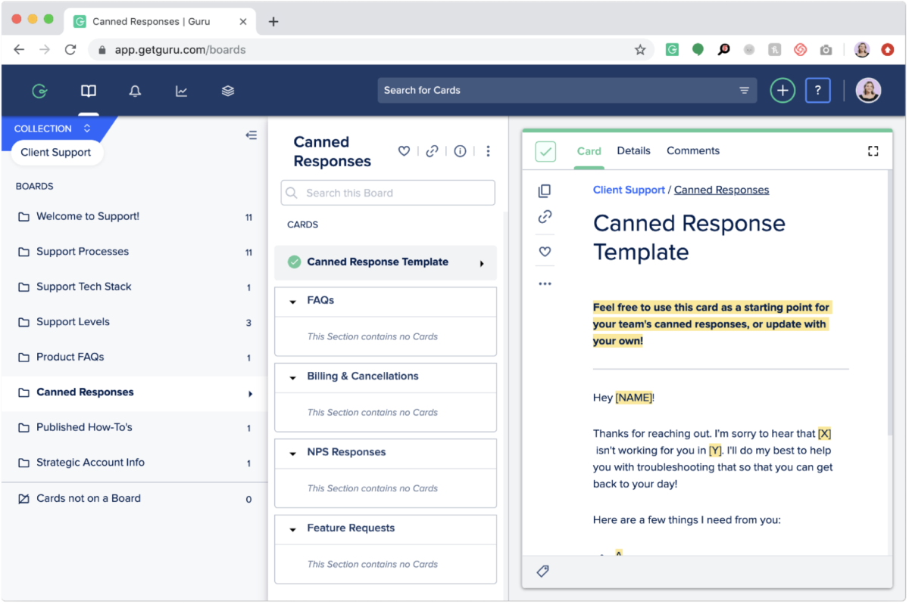

# Scoliologic Wiki - Корпоративная Wiki с AI

<div align="center">


**Корпоративная база знаний с искусственным интеллектом**

[](LICENSE)
[](docker-compose.yml)
[](https://www.typescriptlang.org/)
[](https://reactjs.org/)

</div>

---

## 🚀 Основные возможности

| Функция | Описание |
|---|---|
| **📝 WYSIWYG Редактор** | Мощный редактор с поддержкой таблиц, кода, изображений и видео. |
| **🤖 AI-Ассистент** | Улучшение текста, генерация контента, семантический поиск. |
| **🔐 Права доступа** | Гибкая настройка прав на уровне страниц и групп. |
| **🗂️ Иерархия страниц** | Вложенная структура для удобной организации. |
| **🔍 Умный поиск** | Полнотекстовый и семантический поиск по всей базе знаний. |
| **🌓 Темная/Светлая тема** | Адаптивный интерфейс для комфортной работы. |
| **🔔 Уведомления** | Интеграция с Telegram и Slack для оповещений. |
| **🐳 Self-Hosted** | Полный контроль над данными с развертыванием на своих серверах. |


---

## 🛠️ Технологический стек

| Слой | Технология |
|---|---|
| **Frontend** | React, TypeScript, Vite, TailwindCSS, TipTap |
| **Backend** | Node.js, Express, tRPC, PostgreSQL, Drizzle ORM |
| **AI** | Ollama (локальный LLM), Nomic (Embeddings) |
| **Инфраструктура** | Docker, Docker Compose, Traefik, Redis, MinIO |

---

## ⚙️ Установка и запуск

### Требования
- Docker (v20.10+)
- Docker Compose (v2.5+)
- Git

### 1. Клонирование репозитория

```bash
git clone https://github.com/sileade/scoliologic-wiki.git
cd scoliologic-wiki
```

### 2. Конфигурация

Скопируйте `.env.production.example` в `.env` и заполните необходимые переменные:

```bash
cp .env.production.example .env
nano .env
```

**Ключевые переменные:**
- `DATABASE_URL`: URL для подключения к PostgreSQL
- `S3_ENDPOINT`, `S3_ACCESS_KEY`, `S3_SECRET_KEY`: Данные для MinIO/S3
- `OLLAMA_BASE_URL`: URL для Ollama
- `OWNER_OPENID`: OpenID администратора

### 3. Запуск

```bash
# Запуск всех сервисов
docker-compose up -d

# Просмотр логов
docker-compose logs -f app
```

Приложение будет доступно по адресу `http://localhost:3000`.

### 4. Обновление

Для обновления до последней версии используйте скрипт:

```bash
./deploy/update.sh update
```

---

## 🔒 Безопасность

### Текущий статус

```
$ pnpm audit
No known vulnerabilities found
```

**✅ 0 уязвимостей** — все зависимости проверены и обновлены.

### Защита приложения

| Аспект | Статус | Описание |
|---|---|---|
| **Аутентификация** | ✅ | OAuth 2.0 через Authentik/Manus |
| **Авторизация** | ✅ | RBAC + права на уровне страниц |
| **XSS защита** | ✅ | DOMPurify санитизация (60+ тестов) |
| **SQL Injection** | ✅ | Параметризованные запросы через Drizzle ORM |
| **Rate Limiting** | ✅ | Защита API, AI и auth эндпоинтов |
| **CORS** | ✅ | Настроенная политика cross-origin |
| **Secrets** | ✅ | Через переменные окружения |

### Устранённые уязвимости (январь 2026)

В версии 1.0.0 были устранены **16 уязвимостей** (1 low, 8 moderate, 7 high):

| Пакет | Проблема | Решение |
|---|---|---|
| `@aws-sdk/*` | Устаревшие версии | Обновлено до `^3.750.0` |
| `wouter` | Уязвимость в роутинге | Обновлено до `^3.9.0` |
| `lodash-es` | Prototype Pollution | Override до `4.17.23` |
| `lodash` | Prototype Pollution | Override до `4.17.23` |
| `esbuild` | Уязвимость сборщика | Override до `0.25.12` |
| `vitest` | Устаревшая версия | Обновлено до `^3.2.4` |

### Проверка безопасности

Для проверки текущего статуса выполните:

```bash
pnpm audit
```

Для автоматического исправления:

```bash
pnpm update --latest
pnpm audit
```

---

## 📈 Производительность

- **Кэширование:** Redis для AI-запросов, поиска и embeddings.
- **Оптимизация БД:** Индексы, batch-запросы.
- **Ленивая загрузка:** Компоненты React загружаются по мере необходимости.



---

## 🤝 Участие в разработке

Мы приветствуем любой вклад в развитие проекта. Пожалуйста, ознакомьтесь с `CONTRIBUTING.md` для получения дополнительной информации.

## 📄 Лицензия

Проект распространяется под лицензией **MIT**.
